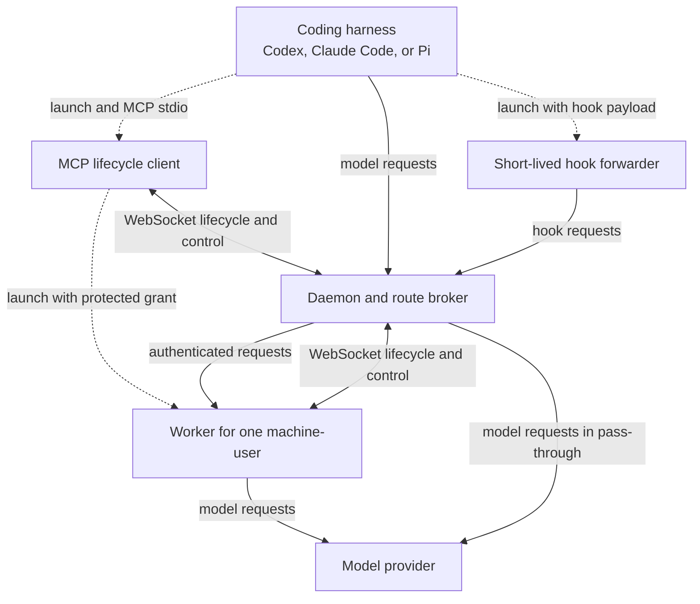
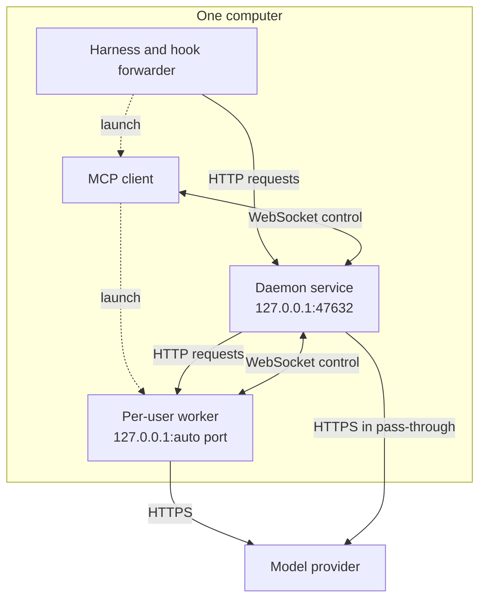
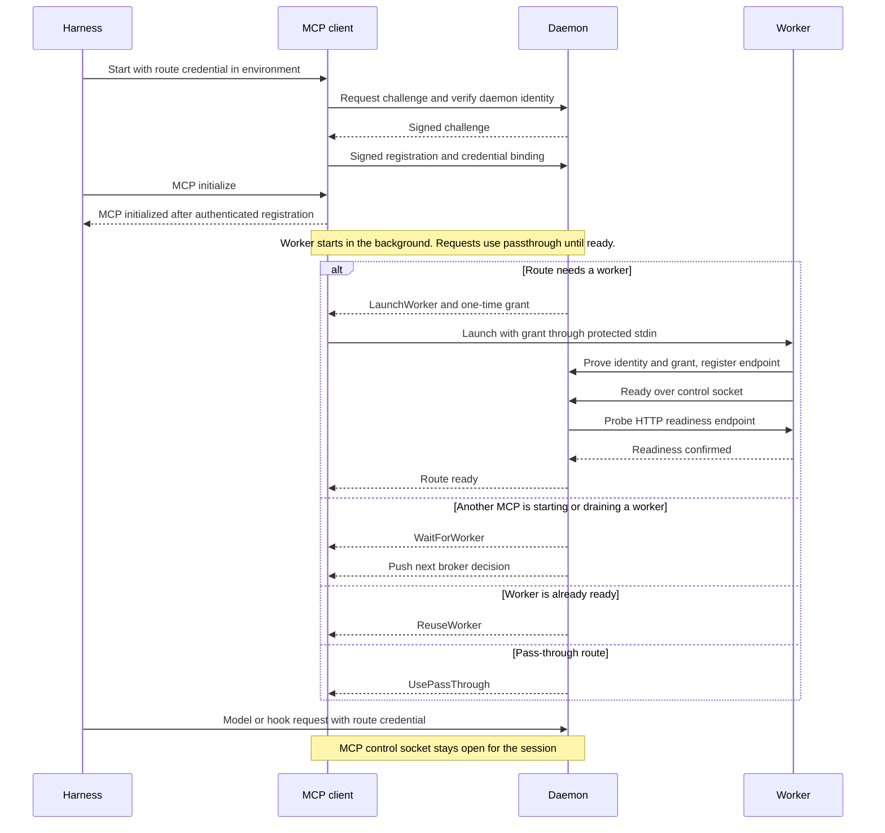
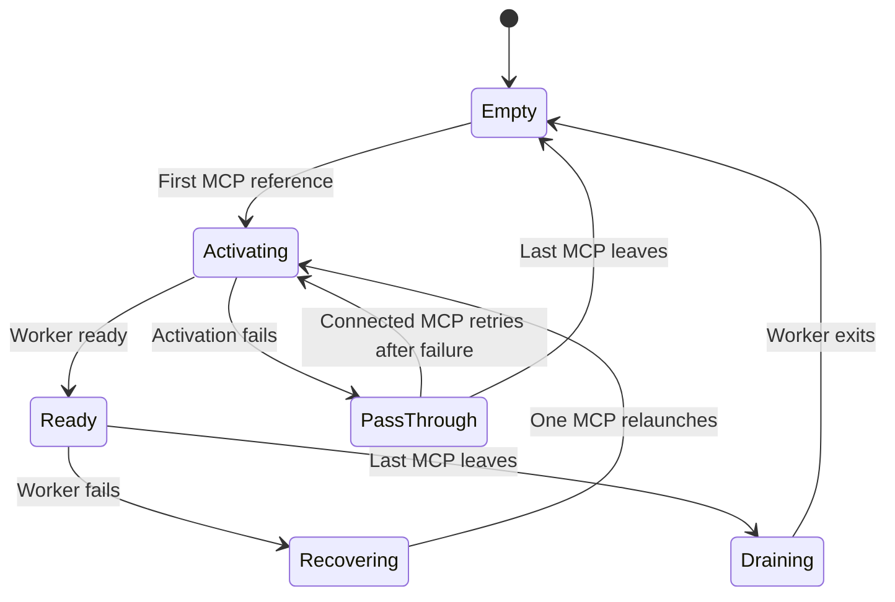

{/* SPDX-FileCopyrightText: Copyright (c) 2026, NVIDIA CORPORATION & AFFILIATES. All rights reserved.
SPDX-License-Identifier: Apache-2.0 */}

On narrow screens, scroll diagrams horizontally to read every label.

## Process Roles

The harness launches `nemo-relay daemon mcp` as a Model Context Protocol (MCP)
process over standard input and output. This MCP connection keeps a reference
open with the daemon. It provides no tools. The daemon's **broker** decides
whether the user-machine route needs a new worker or can share an existing one.

The MCP process starts a worker on the **client computer** only when the broker
instructs it to. The worker loads the administrator's system configuration and
plugins. Install the daemon as a service. The harness starts MCP, and the broker
controls worker startup and shutdown.

The diagram shows how these processes communicate:

Dotted arrows show process startup. Solid arrows show communication. Responses
return along the request path. Model streams travel back through the worker and
daemon to the harness. Hook responses return through the hook forwarder.
The harness and hook forwarder do not contact a worker directly.

MCP and worker processes each open a persistent WebSocket control session to the
daemon. The daemon pushes route decisions and drain commands on those sessions.
Model and hook traffic use separate HTTP connections.

The daemon also exposes read-only HTTP operations for process health and
last-known worker assignments. `/healthz` describes the daemon process and its
global deployment mode. `/_nemo_relay/v1/workers`,
`/_nemo_relay/v1/workers/status`, and the per-worker status path read the
broker's in-memory state without probing workers. Routes without an assigned
worker, including pass-through routes, do not appear in worker results.

## Local Deployment

The diagram shows the processes on one computer:

A system daemon has its own service identity. Each user's MCP and worker use that
user's identity. Several harness sessions for the same identity share one worker.
Different users do not share runtime state. The operating system assigns the
default worker port. MCP starts workers when the broker requests them.

## Initialization Sequence

The diagram shows startup with a daemon that supports parallel initialization:

After registration and authentication, MCP handles standard input and output
while the worker starts. MCP readiness alone does not prove that a worker is
running. New requests use passthrough during startup by default.

The daemon starts routing new requests to a worker after these checks pass:

- The worker has initialized its runtime and plugins.
- Its control connection is authenticated.
- Its HTTP readiness probe succeeds.

Use `--require-worker` to return HTTP `503` while these checks are pending.
With older daemons, MCP waits for a usable route before it handles initialization.

## Shutdown and Recovery

The diagram shows the main worker states and how they change:

The `--pass-through` flag disables worker startup. A draining worker cannot
return to service. Its replacement waits for it to exit. During that wait, new
requests use passthrough by default. Accepted requests have up to two minutes to
finish. Workers stop accepting new requests if they lose authenticated daemon
control.

Refer to [Identity and Lifecycle](/daemon/reference#understand-broker-identity-and-lifecycle)
for reconnect grace, remote keepalive timing, restart recovery, and all broker states.

Worker startup has no deadline. The daemon logs a progress message every
60 seconds and records how long startup took when the worker joins the route.
If startup fails, the daemon retries after one second, then two, four, and so on.
Retry delays stop increasing at 60 seconds. There is no attempt limit.

If the MCP client that starts the worker disconnects, the daemon cancels its
launch grant. Another connected MCP can then receive a new grant.

When startup fails or the daemon cancels a launch, it releases the worker's
staged registration right away. Published workers keep their reconnect grace
period. Slow writes to daemon state do not block request streams or health checks.

Each request keeps the destination selected when it starts. Streams already
sent through passthrough finish on that path. Later requests use the ready
worker. Relay never sends the same submitted request to both destinations.
